```{=latex}
\thispagestyle{empty}
\begin{center}

\vspace*{0.5cm}

\includegraphics[width=4cm]{Ensai-logo.png}

\vspace{0.6cm}

{\large \textbf{École Nationale de la Statistique}}\\[0.2cm]
{\large \textbf{et de l'Analyse de l'Information}}\\[0.3cm]
{\normalsize Première année --- Projet Traitement de Données}

\vspace{1.5cm}
\noindent\rule{\textwidth}{1.5pt}\\[0.6cm]
{\LARGE \textbf{Application de Consultation}}\\[0.3cm]
{\LARGE \textbf{de Statistiques Sportives}}\\[0.6cm]
\noindent\rule{\textwidth}{1.5pt}

\vspace{1.8cm}

\begin{minipage}[t]{0.48\textwidth}
\centering
{\large \textbf{Membres du groupe}}\\[0.5cm]
{\large
Maxime Bounea\\[0.25cm]
Martin Dubos\\[0.25cm]
Nolann Bougis\\[0.25cm]
Zoeb Gouloumaly
}
\end{minipage}
\hfill
\begin{minipage}[t]{0.48\textwidth}
\centering
{\large \textbf{Tuteur pédagogique}}\\[0.5cm]
{\large Clément Valot}
\end{minipage}

\vfill

{\large Année universitaire 2025--2026}

\end{center}

\newpage
\thispagestyle{plain}
\tableofcontents
\newpage
\setcounter{page}{1}
```

# Introduction {.unnumbered}

Dans le cadre du projet de Traitement de Données, nous avons développé une application Python permettant de charger, structurer et analyser des données sportives provenant de fichiers CSV. L'objectif du projet était de concevoir une architecture suffisamment générique pour pouvoir gérer plusieurs sports différents tout en conservant une structure commune et réutilisable.

Notre application permet aujourd'hui de traiter des données de Tennis, Football, Basketball, Volleyball et Badminton. Les données utilisées proviennent de jeux de données fournis contenant des informations sur les joueurs, équipes, matchs, saisons ou encore statistiques de performance.

Pour mener à bien notre projet, nous avons d'abord dû lire et nettoyer des fichiers CSV ayant des structures très différentes selon les sports. Ces données ont ensuite été transformées en objets Python afin d'obtenir un modèle de données commun à l'ensemble de l'application. Nous avons également mis en place différents calculs statistiques comme les classements, les taux de victoire, les confrontations directes ou certaines statistiques spécifiques aux différents sports. Enfin, les résultats peuvent être consultés directement depuis une interface en ligne de commande et certaines évolutions sont visualisées à l'aide de graphiques.

L'un des principaux enjeux était de construire une architecture modulaire capable de s'adapter facilement à de nouveaux jeux de données. Pour cela, nous avons séparé le projet en plusieurs couches : modèle de données, chargement des fichiers CSV, calculs statistiques et interface utilisateur. Cette organisation nous a permis de mutualiser une grande partie du code tout en gardant des traitements spécifiques pour chaque sport lorsque cela était nécessaire. Enfin, la bibliothèque Pandas nous a été utile. Nous l'avons utilisé pour lire les CSV, nettoyer les données, gérer les valeurs manquantes et calculer les statistiques.

Dans la suite de ce rapport, nous présenterons d'abord le contexte du projet, les besoins fonctionnels de l'application ainsi que les différents jeux de données utilisés. Nous détaillerons ensuite la conception de notre application, en expliquant la modélisation orientée objet, l'architecture générale du projet et les principaux choix technologiques réalisés. Nous reviendrons ensuite sur la réalisation du projet, notre organisation de travail et les principales difficultés rencontrées durant le développement. Enfin, nous présenterons les tests effectués, les résultats obtenus, les limites actuelles de l'application ainsi que les améliorations.

# Présentation du projet

## Contexte

Le projet nous a été soumis dans le cadre du cours de Traitement de Données de première année. L'objectif général était de concevoir une application Python capable de traiter des données sportives brutes --- typiquement des fichiers CSV --- pour en extraire des objets structurés représentant des matchs, des compétitions, des équipes ou des joueurs.

Au-delà de la simple lecture de données, l'application devait permettre d'enrichir ces objets au fil du temps : ajouter les résultats d'une nouvelle compétition, recalculer les statistiques des joueurs ou des équipes en tenant compte des nouvelles données. L'idée était donc de produire un outil évolutif, pas un simple script de lecture figé.

Le cahier des charges imposait également que l'application soit capable de fonctionner sur plusieurs jeux de données distincts. Certaines caractéristiques propres à un sport (surface en tennis, ligue en football, type de saison en basketball...) pouvaient être gérées de façon spécifique, mais les fonctionnalités de base --- chargement, recherche, affichage des statistiques --- devaient rester opérationnelles quel que soit le sport traité.

Dans le cadre de ce projet, nous avons choisi de développer une application de consultation de statistiques multi-sports. Nous avons interprété le sujet en privilégiant la diversité des sports couverts et la richesse des fonctionnalités offertes à l'utilisateur. Notre application couvre cinq sports : le tennis (circuits ATP et WTA), le football (ligues européennes), le basketball (NBA), le badminton et le volleyball (Jeux Olympiques de Paris 2024).

Nous avons opté pour une interface en ligne de commande (CLI), conforme aux contraintes du projet, et une architecture orientée objet permettant d'ajouter facilement de nouveaux sports sans modifier le cœur du code.

## Besoins fonctionnels

L'application répond à huit grandes fonctionnalités :

**F1 --- Chargement des données :** L'utilisateur peut charger les données CSV d'un ou plusieurs sports. Les données sont ensuite sérialisées via pickle afin d'éviter de relire les fichiers à chaque lancement, ce qui réduit considérablement les temps de démarrage.

**F2 --- Recherche d'un joueur :** L'utilisateur peut rechercher un joueur par son nom (ou une partie de son nom). La recherche est insensible à la casse. En cas d'homonymes, l'application propose une liste et invite l'utilisateur à choisir. La fiche du joueur affiche ses statistiques globales calculées depuis les matchs (taux de victoire, aces, double-fautes pour le tennis, etc.).

**F3 --- Statistiques d'une équipe :** Pour les sports collectifs (football, basketball), l'utilisateur peut consulter les statistiques d'une équipe pour une saison donnée : classement, points, buts marqués et encaissés pour le football ; PPG, RPG, APG, Net Rating, eFG% pour le basketball.

**F4 --- Confrontations directes (H2H) :** L'application affiche l'historique des confrontations entre deux joueurs ou deux équipes, avec le nombre de victoires de chaque côté et les éventuels matchs nuls.

**F5 --- Vue détaillée par compétition :** Pour le football, l'utilisateur peut afficher le classement complet d'un championnat pour une saison donnée. Pour le basketball, une vue détaillée de la NBA présente les conférences Est et Ouest, le play-in et les playoffs.

**F6 --- Évolution graphique :** L'application génère un graphique matplotlib montrant l'évolution du classement ou des points d'un joueur ou d'une équipe saison par saison.

**F7 --- Module Volleyball JO 2024 :** Un module dédié permet de consulter les résultats de la compétition de volleyball aux Jeux Olympiques de Paris 2024, les statistiques par équipe (ratio de sets, profil des victoires), les profils des athlètes (taille par pays, distribution des âges) et l'encadrement technique.

**F8 --- Ajout de jeux de données :** L'utilisateur peut ajouter un nouveau jeu de données CSV via le menu, sans modifier le code source.

Les contraintes techniques imposées sont les suivantes : langage Python 3, paradigme orienté objet, gestion de versions avec Git et GitHub, tests unitaires, données en entrée sous forme de fichiers CSV uniquement, interface en ligne de commande.

## Présentation des données

Notre application exploite cinq jeux de données distincts :

**Tennis :** Les données proviennent du dépôt public de Jeff Sackmann (tennis_atp / tennis_wta). Elles contiennent les résultats de la saison 2024, avec 443 joueurs ATP, plusieurs centaines de joueuses WTA, et plusieurs milliers de matchs. Chaque match contient des statistiques détaillées de service (aces, double-fautes, premier service, balles de break).

**Football :** Les données sont issues de la European Soccer Database (Kaggle), couvrant les principales ligues européennes sur plusieurs saisons. La base contient plusieurs milliers de joueurs, d'équipes et de matchs, répartis sur plusieurs ligues (Premier League, La Liga, Bundesliga, Serie A, Ligue 1...).

**Basketball :** Les données NBA proviennent de Kaggle et couvrent plusieurs saisons. Elles incluent les résultats des matchs de saison régulière et des playoffs, ainsi que des statistiques avancées par équipe (Net Rating, eFG%, Pace...).

**Badminton :** Un jeu de données contenant les joueurs et les résultats de matchs internationaux.

**Volleyball :** Les données des Jeux Olympiques de Paris 2024 (tournois masculin et féminin) incluent les matchs, les profils des joueurs et joueuses, ainsi que les staffs techniques de chaque équipe nationale.

Ces jeux de données ont été choisis pour leur richesse, leur disponibilité en accès libre et la diversité des sports qu'ils représentent. Chaque jeu de données a nécessité un traitement spécifique en raison de formats différents (noms de colonnes, encodages, structures des saisons).

# Conception de l'application

## Modélisation

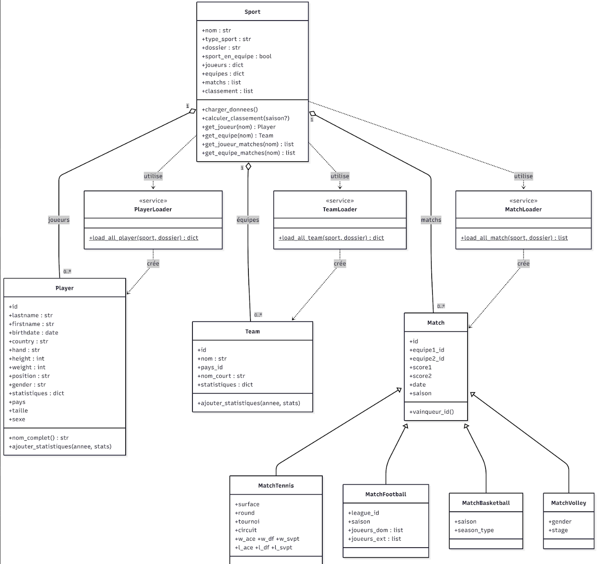{fig-align="center" fig-pos="H" width="95%"}

Notre modèle objet repose sur quatre classes principales.

La classe **Player** représente un joueur, toutes disciplines confondues. Elle regroupe les informations essentielles (identifiant, nom, prénom, date de naissance, pays, taille, poids, position et genre) et contient un dictionnaire de statistiques permettant de stocker, par saison, les données calculées.

La classe **Team** représente une équipe ou un pays selon le sport. Elle contient les informations d'identification (nom, nom court) ainsi qu'un dictionnaire de statistiques par saison.

La classe **Match** constitue la base commune à tous les matchs. Elle stocke les identifiants des deux adversaires, les scores, la date et la saison. Elle fournit notamment la méthode `vainqueur_id()`, qui retourne le gagnant ou `None` en cas d'égalité. Quatre sous-classes spécialisées héritent de cette classe et ajoutent des attributs propres à chaque sport :

- **MatchTennis** (surface, tournoi, circuit, statistiques de service)
- **MatchFootball** (ligue et compositions des équipes)
- **MatchBasketball** (type de saison : régulière, playoffs, play-in)
- **MatchVolley** (genre et phase de compétition)

Enfin, la classe **Sport** joue le rôle d'agrégateur central. Elle regroupe l'ensemble des joueurs et des équipes sous forme de dictionnaires indexés par identifiant, ainsi que la liste des matchs. Elle fournit des méthodes de recherche (par exemple les matchs d'un joueur ou d'une équipe) et de calcul de classement.

## Architecture générale

L'application est organisée en quatre couches distinctes.

La **couche Interface** (`__main__.py`) gère l'interaction avec l'utilisateur : affichage des menus, saisie des commandes et appel des différentes fonctionnalités d'affichage et de visualisation. Elle constitue le point d'entrée unique de l'application.

La **couche Analyse** (`src/Analysis/`) regroupe les traitements plus avancés, notamment le module GoatFinder, qui permet de comparer les performances des meilleurs joueurs.

La **couche Chargement** (`src/Parsers/`) est chargée de la lecture et du parsing des fichiers CSV. Elle est structurée en trois familles de loaders : `MatchLoader`, `PlayerLoader` et `TeamLoader`. Chacune dispose d'un module principal qui redirige vers des loaders spécifiques à chaque sport (par exemple `FootballPlayerLoader` ou `TennisMenPlayerLoader`).

La **couche Modèle** (`src/Model/`) contient les classes principales du domaine : `Player`, `Team`, `Match` et ses sous-classes, ainsi que `Sport`, qui sert à regrouper l'ensemble des données.

Le flux de données suit donc le schéma suivant : les fichiers CSV sont d'abord lus par les Parsers, qui créent les objets du Modèle. Ces objets sont ensuite regroupés dans une instance de `Sport`, elle-même sérialisée avec pickle afin de permettre un rechargement rapide. Lors de l'exécution, `__main__.py` charge directement cet objet et l'utilise pour toutes les interactions avec l'utilisateur.

## Choix technologiques

Le projet est réalisé en **Python 3**, qui est le langage demandé dans le cahier des charges. Python est utilisé ici car il propose beaucoup d'outils déjà prêts pour travailler sur des données.

On utilise **Pandas** pour lire et manipuler les fichiers CSV. C'est très pratique car il permet de gérer facilement les données manquantes, de filtrer les informations et de faire des calculs simples sur les données sans avoir à tout coder soi-même.

Pour les graphiques, on a choisi **Matplotlib**. Il permet de créer différents types de visualisations comme des courbes, des histogrammes ou des diagrammes en barres. Les graphiques peuvent aussi être enregistrés sous forme d'images, ce qui est utile pour les rapports.

On utilise également **Pickle** pour sauvegarder les données déjà chargées. Cela évite de relire les fichiers CSV à chaque fois, ce qui fait gagner beaucoup de temps, surtout quand les fichiers sont volumineux.

Pour travailler en groupe et garder un historique du code, on utilise **Git et GitHub**, comme demandé dans le projet.

Enfin, les tests sont réalisés avec **pytest**, qui permet de vérifier automatiquement que le code fonctionne correctement, en complément des outils de test de base de Python.

# Réalisation

## Organisation du travail

Nous avons avancé sur le projet de manière assez progressive, en nous répartissant naturellement les tâches selon les besoins et les affinités de chacun. Certains membres se sont davantage occupés du chargement et du nettoyage des données, tandis que d'autres ont surtout travaillé sur les statistiques, les visualisations ou l'interface utilisateur. Même si chacun avait ses parties principales, nous avons régulièrement relu et testé le travail des autres afin de garder une application cohérente dans son ensemble.

Les contributions au projet ont été réparties entre le développement des fonctionnalités, les corrections de bugs, les tests et la restructuration du code.

## Développement

L'utilisateur peut dans un premier temps charger un ou plusieurs jeux de données depuis des fichiers CSV.

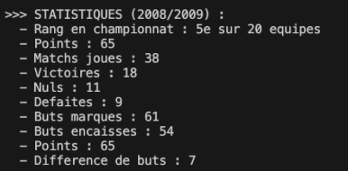{fig-align="center" fig-pos="H" width="85%"}

Lors du chargement, les données sont lues avec Pandas, nettoyées puis converties en objets Python afin d'être manipulées plus facilement dans le reste de l'application. Une fois les données traitées, elles sont sauvegardées localement avec Pickle afin d'éviter de relire les fichiers CSV à chaque exécution du programme.

Différentes statistiques sur les joueurs, équipes et matchs vont pouvoir être consultées. Déjà, plusieurs statistiques globales sont calculées automatiquement à partir des matchs chargés.

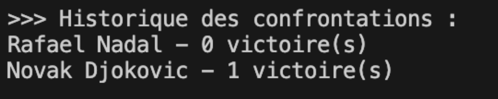{fig-align="center" fig-pos="H" width="85%"}

Nous avons notamment implémenté le calcul du nombre de matchs joués, du taux de victoire, des confrontations directes entre deux joueurs ou équipes ainsi qu'un système de classement basé sur les résultats des rencontres.

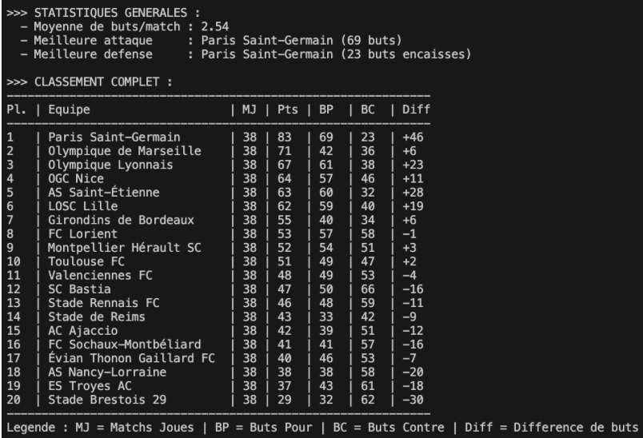{fig-align="center" fig-pos="H" width="85%"}

Ce classement attribue trois points pour une victoire et un point en cas de match nul. Il peut être affiché de manière globale ou filtré par saison.

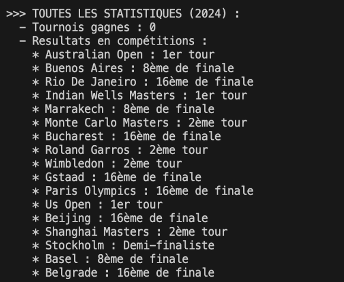{fig-align="center" fig-pos="H" width="85%"}

Certaines statistiques spécifiques ont également été ajoutées pour le tennis. À partir des données ATP et WTA, l'application calcule par exemple le nombre de tournois remportés par chaque joueur ainsi que leur meilleur résultat en Grand Chelem.

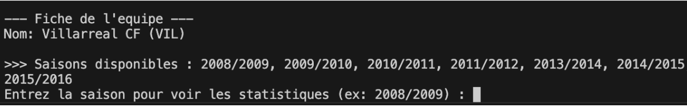{fig-align="center" fig-pos="H" width="85%"}

Ces statistiques sont directement stockées dans les objets joueurs afin d'être facilement accessibles depuis l'interface.

Nous avons également ajouté plusieurs filtres afin de rendre l'exploration des données plus flexible. Il est par exemple possible de filtrer certains classements par saison ou par sexe lorsque les données le permettent.

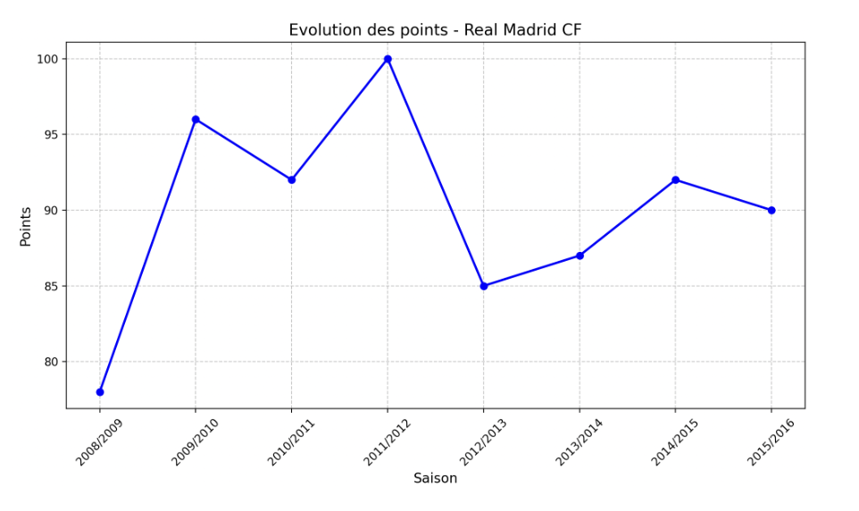{fig-align="center" fig-pos="H" width="85%"}

Enfin, l'application propose une partie visualisation reposant sur la bibliothèque Matplotlib. L'utilisateur peut afficher l'évolution des points ou du classement d'un joueur ou d'une équipe au fil des saisons. Ces graphiques permettent d'obtenir une représentation plus claire des performances et facilitent l'analyse des résultats sur plusieurs années.

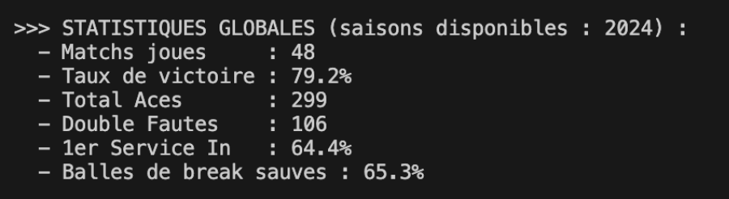{fig-align="center" fig-pos="H" width="85%"}

L'ensemble de ces fonctionnalités repose sur une architecture modulaire, via l'utilisation d'une structure commune basée sur les classes `Player`, `Team`, `Match` et `Sport`.

Nous avons également développé plusieurs modules spécifiques selon les sports. Pour le tennis, nous avons intégré des statistiques avancées comme les aces, les doubles fautes ou les pourcentages de premières balles.

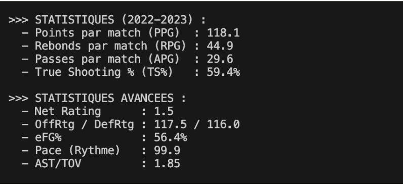{fig-align="center" fig-pos="H" width="85%"}

Pour le basketball, nous avons ajouté des statistiques collectives avancées comme le Net Rating ou le eFG%.

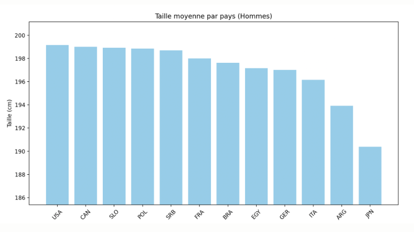{fig-align="center" fig-pos="H" width="85%"}

| Statistique | Définition |
|:--|:--|
| PPG / RPG / APG | Moyennes de Points, Rebonds et Passes par match |
| TS% | True Shooting % (efficacité globale incluant les lancers francs) |
| Net Rating | Différence de points marqués/encaissés sur 100 possessions |
| OffRtg | Points marqués pour 100 possessions |
| DefRtg | Points encaissés pour 100 possessions |
| eFG% | Efficacité au tir (ajuste la valeur des tirs à 3 points) |
| Pace | Nombre de possessions estimées par match (48 minutes) |
| AST/TOV | Ratio Passes décisives / Pertes de balle |

: Légende des statistiques basketball {tbl-colwidths="[25,75]"}

Enfin, pour le volleyball des Jeux Olympiques 2024, nous avons développé des visualisations et des statistiques spécifiques sur les équipes nationales et les profils des joueurs.

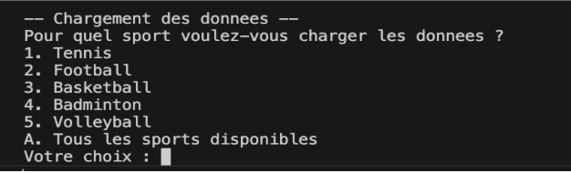{fig-align="center" fig-pos="H" width="85%"}

## Difficultés rencontrées

Un des premiers problèmes rencontrés venait de la qualité des données. Les fichiers CSV n'étaient pas toujours bien organisés, ce qui nous a obligés à nettoyer et harmoniser certaines informations, par exemple les dates ou les codes pays. On a aussi beaucoup utilisé la bibliothèque Numpy pour repérer les valeurs manquantes (NaN), ce qui nous a évité pas mal d'erreurs dans les calculs et les conversions.

Sur la partie conception, il a fallu bien réfléchir à la manière d'organiser le code. L'idée était d'avoir une classe générale `Match` commune à tous les sports, tout en laissant chaque sport gérer ses particularités. On a ensuite ajouté un système de type Factory pour charger les données. C'était un peu compliqué au début, mais au final ça rend le projet beaucoup plus flexible, puisqu'on peut ajouter un nouveau sport sans tout modifier. De plus, pour la recherche des statistiques par joueur/équipe, nous avons adapté notre programme pour que l'utilisateur puisse rechercher une partie du nom de ceux-ci.

Enfin, ce projet nous a aussi fait prendre conscience de certains problèmes liés aux données et à leur traitement. Par exemple, en football, les classements mélangeaient plusieurs compétitions, ce qui faussait les résultats. On a donc dû séparer correctement les ligues pour obtenir quelque chose de cohérent. On a également dû utiliser Pickle pour éviter de recalculer les mêmes données à chaque fois, ce qui rend l'application beaucoup plus rapide à l'usage et plus agréable à utiliser.

# Tests et validation

## Stratégie de test

Nous avons adopté une approche de tests unitaires basée sur pytest, afin de vérifier le bon fonctionnement des différentes parties de l'application de manière isolée. L'objectif est de s'assurer que chaque composant fonctionne correctement, indépendamment du reste du programme.

Les tests sont organisés dans un dossier `test/` qui reprend la même structure que le dossier `src/`, ce qui facilite la compréhension et la navigation dans le projet.

Les modules couverts par les tests sont :

- `Common/test_utils.py` pour les fonctions utilitaires
- `Model/test_Match.py` pour la classe `Match` et ses variantes
- `Model/test_Player.py` pour la classe `Player`
- `Model/test_Team.py` pour la classe `Team`
- les modules de parsing pour le badminton, le football et le volleyball (matchs et joueurs)

Les tests des classes du modèle utilisent des objets créés directement dans les fichiers de test avec des valeurs simples. Cela permet de vérifier les comportements principaux comme le calcul du vainqueur, l'initialisation des attributs ou la gestion des cas particuliers (égalité, valeurs par défaut, etc.).

Pour les parsers, des fichiers CSV simplifiés sont utilisés afin de tester uniquement la lecture et la transformation des données.

Cette approche permet de sécuriser les fonctionnalités principales du projet et de limiter les erreurs lors des évolutions du code.

## Quelques résultats

Les tests réalisés montrent que l'application répond correctement aux principales fonctionnalités attendues. Les données sont correctement chargées et transformées en objets exploitables, tandis que les statistiques calculées restent cohérentes avec les résultats présents dans les jeux de données.

L'application permet notamment d'obtenir des classements fiables, d'afficher des fiches détaillées de joueurs ou d'équipes, de consulter des confrontations directes et de générer des graphiques d'évolution selon les saisons. Les temps de chargement ont également été nettement améliorés grâce à pickle.

## Limites de l'application

Même si l'application fonctionne correctement sur l'ensemble des fonctionnalités prévues, elle présente encore certaines limites. Les performances restent sensibles à la taille des fichiers CSV, en particulier pour les jeux de données les plus volumineux comme ceux du football ou du basketball. Par ailleurs, certaines données disponibles dans les fichiers ne sont pas encore exploitées, ce qui laisse de la marge pour enrichir les analyses et les statistiques proposées. Enfin, l'application repose uniquement sur une interface en ligne de commande. Cela la rend fonctionnelle mais moins accessible pour des utilisateurs non habitués à ce type d'environnement, et limite son côté grand public.

# Conclusion

Ce projet nous a permis de construire une application Python complète, allant de la lecture de données sportives jusqu'à leur analyse et leur visualisation. Nous avons travaillé sur cinq sports différents, en essayant de proposer des fonctionnalités utiles tout en respectant les contraintes du projet : programmation orientée objet, utilisation de Git, tests unitaires et interface en ligne de commande.

Sur le plan technique, ce travail nous a permis de progresser sur des outils importants comme pandas pour la gestion des données, matplotlib pour les graphiques et Git pour le travail en groupe. Il nous a aussi appris à mieux structurer un projet en plusieurs parties bien séparées, ce qui rend le code plus clair et plus facile à faire évoluer.

Finalement, ce projet a été une expérience très formatrice. Il nous a permis de faire le lien entre ce que nous voyons en cours et la réalisation concrète d'une application complète. On a aussi compris qu'un projet fonctionne vraiment bien quand la structure est pensée dès le début et quand le travail est bien organisé entre les membres de l'équipe.
